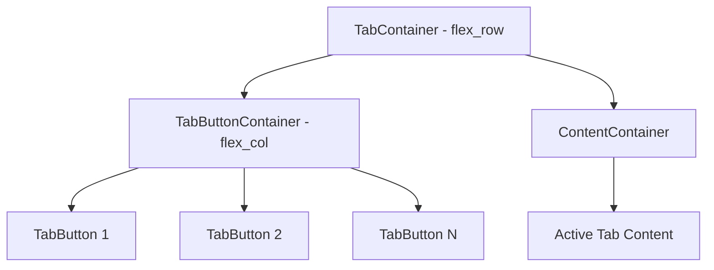

# TabContainer Component Design

## Overview

A TabContainer component for the `yi` UI module that displays tabs on the left side and the active tab's content on the right side.

## Interface

```lua
local overview_tab = {
    icon = Label(res:getFont("icons", 24), "%"),
    text = Label(res:getFont("bold", 24), "Overview"),
    content = View()
}

local scores_tab = {
    icon = Label(res:getFont("icons", 24), "!"),
    text = Label(res:getFont("bold", 24), "Scores"),
    content = View()
}

local tab_container = TabContainer({overview_tab, scores_tab})
```

## Architecture



## Components

### 1. TabContainer

The main container view with `flex_row` arrangement.

**Structure:**
- Left side: `TabButtonContainer` with `flex_col` arrangement containing tab buttons
- Right side: `ContentContainer` showing the active tab's content

**Responsibilities:**
- Store all tab data
- Manage active tab index
- Handle tab switching via `attach`/`detach`

### 2. TabButton

A clickable button view representing a single tab.

**Structure:**
- Contains icon Label and text Label arranged vertically
- Handles mouse input for tab selection

**Visual States:**
- Normal: `Colors.button` background
- Hover: `Colors.button_hover` background
- Active: `Colors.accent` or highlighted state

## Implementation Details

### TabContainer.lua

```lua
local View = require("yi.views.View")
local TabButton = require("yi.views.TabButton")

---@class yi.TabContainer : yi.View
---@overload fun(tabs: table): yi.TabContainer
local TabContainer = View + {}

---@param tabs table Array of tab definitions
function TabContainer:new(tabs)
    View.new(self)
    self.tabs = tabs or {}
    self.active_index = 1
    self.handles_mouse_input = true
end

function TabContainer:load()
    -- Create left panel for tab buttons
    self.button_container = View()
    self.button_container:setup({
        arrange = "flex_col",
        width = 200,  -- Configurable
        height = "100%",
        gap = 2
    })
    self:add(self.button_container)
    
    -- Create right panel for content
    self.content_container = View()
    self.content_container:setup({
        width = "100%",
        height = "100%",
        grow = 1
    })
    self:add(self.content_container)
    
    -- Create tab buttons
    for i, tab in ipairs(self.tabs) do
        local button = TabButton(tab, function()
            self:selectTab(i)
        end)
        self.button_container:add(button)
    end
    
    -- Attach initial tab content
    if #self.tabs > 0 then
        self.content_container:attach(self.tabs[1].content)
    end
end

---@param index number
function TabContainer:selectTab(index)
    if index == self.active_index then return end
    if index < 1 or index > #self.tabs then return end
    
    -- Detach current content
    local current = self.tabs[self.active_index]
    if current and current.content then
        current.content:detach()
    end
    
    -- Attach new content
    self.active_index = index
    local new_tab = self.tabs[index]
    if new_tab and new_tab.content then
        self.content_container:attach(new_tab.content)
    end
end
```

### TabButton.lua

```lua
local View = require("yi.views.View")
local Colors = require("yi.Colors")

---@class yi.TabButton : yi.View
---@overload fun(tab: table, callback: function): yi.TabButton
local TabButton = View + {}

---@param tab table Tab definition with icon, text, content
---@param callback function Called when button is clicked
function TabButton:new(tab, callback)
    View.new(self)
    self.tab = tab
    self.callback = callback
    self.is_active = false
    self.handles_mouse_input = true
end

function TabButton:load()
    -- Add icon and text as children
    if self.tab.icon then
        self:add(self.tab.icon)
    end
    if self.tab.text then
        self:add(self.tab.text)
    end
end

function TabButton:onMouseDown()
    self.callback()
    return true
end

function TabButton:draw()
    if self.is_active then
        love.graphics.setColor(Colors.accent)
    elseif self.mouse_over then
        love.graphics.setColor(Colors.button_hover)
    else
        love.graphics.setColor(Colors.button)
    end
    love.graphics.rectangle("fill", 0, 0, self:getCalculatedWidth(), self:getCalculatedHeight())
end

---@param active boolean
function TabButton:setActive(active)
    self.is_active = active
end
```

## File Locations

- `yi/views/TabContainer.lua` - Main container component
- `yi/views/TabButton.lua` - Individual tab button component

## Usage Example

```lua
local TabContainer = require("yi.views.TabContainer")
local Label = require("yi.views.Label")
local View = require("yi.views.View")
local h = require("yi.h")

-- In a parent view's load method:
local res = self:getResources()

local overview_tab = {
    icon = Label(res:getFont("icons", 24), "%"),
    text = Label(res:getFont("bold", 24), "Overview"),
    content = View()
}

local scores_tab = {
    icon = Label(res:getFont("icons", 24), "!"),
    text = Label(res:getFont("bold", 24), "Scores"),
    content = View()
}

self:add(h(TabContainer({overview_tab, scores_tab}), {
    width = "100%",
    height = "100%"
}))
```

## Notes

1. The `attach`/`detach` mechanism is used to show/hide tab content without destroying views
2. Tab buttons use `flex_col` arrangement as specified
3. The button container width should be configurable via setup params
4. Active tab highlighting needs visual feedback
